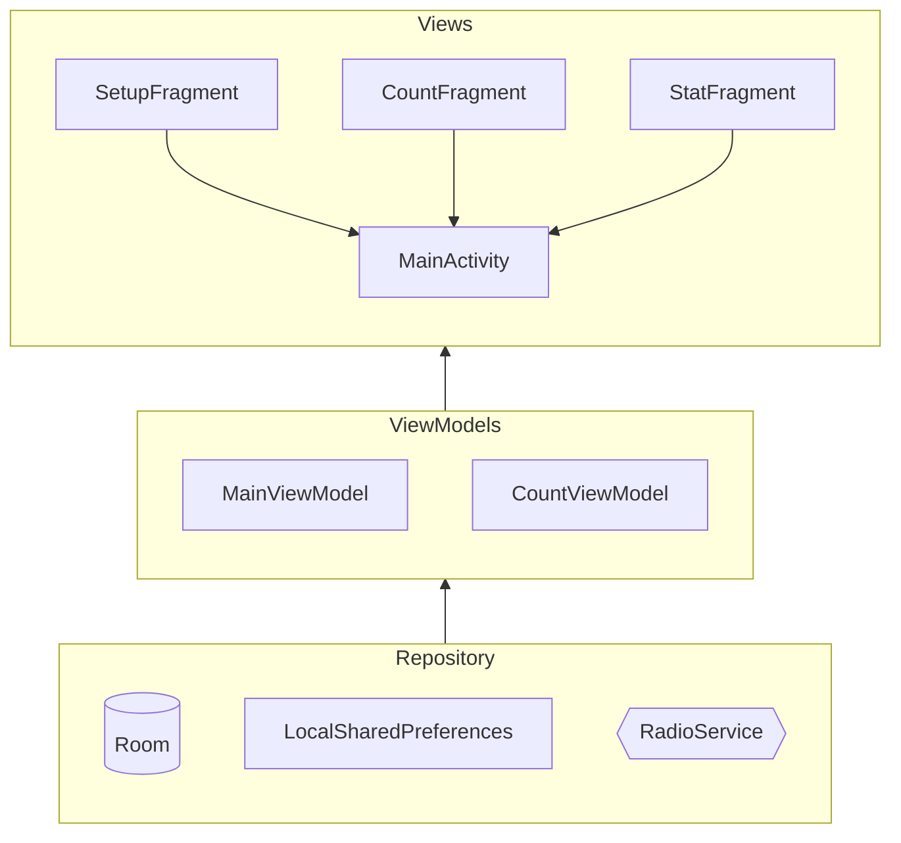

# Fitness Music Counter

An Android workout companion: set a target rep count, start a set, tap to count each rep while an internet radio station streams in the background, then review your workout history afterward.

Built with Kotlin, MVVM, and Dagger Hilt.

## Features

- **Set up a workout** — choose a target rep count and pick a radio station to play while you train.
- **Count reps** — tap to log each rep against a live running timer; the screen is kept on for the whole set, and per-rep split times are tracked automatically.
- **Background radio** — internet radio keeps streaming across screens via a bound `Service` backed by ExoPlayer, so the music doesn't stop when you navigate away.
- **Workout history** — every completed workout (date + time split per rep) is saved to a local Room database and viewable in a history list.

## Architecture

MVVM with a shared `MainViewModel` (setup/radio/history) and a per-screen `CountViewModel` (active workout), wired together with Dagger Hilt.

- **Views** — `MainActivity` hosts three Navigation Component fragments: `SetupFragment`, `CountFragment`, `StatFragment`.
- **ViewModels** — `MainViewModel` (shared across fragments), `CountViewModel` (workout/rep tracking).
- **Data layer** — Room database for workout history, `SharedPreferences` for the saved rep target, and `RadioService`/`RadioServiceManager` for streaming playback.

## Tech Stack

- **Language**: Kotlin
- **DI**: Dagger Hilt
- **UI**: View Binding, Navigation Component, Material Components
- **Persistence**: Room, SharedPreferences
- **Media**: ExoPlayer (streamed via a bound `Service`)
- **Monetization/Analytics**: AdMob, Firebase Analytics

## Radio Sources

Internet radio streams from [NRJ](https://www.nrj.de/) (Berlin, Hits 2000, Dance, Hits Remix, Party Hits, Fitness).

## Building

The `release`/`debug` build types read AdMob keys from `../gitKeyStore/FitnessMusicCounter/secure.properties` (relative to the project root, see `app/build.gradle`) — this file isn't committed to the repo. To build locally, create it with your own `app_api_key`, `ads_full_key`, and `ads_test_key` values (a test AdMob key works fine for local builds).

## License

See [LICENSE](LICENSE).
